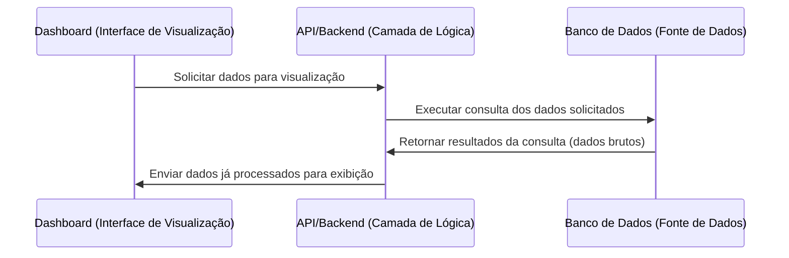

**Explicação Detalhada (Perspectiva de um Engenheiro de Software Sênior para um Usuário Familiarizado com Excel e PROCV)**

Imagine que você possui um painel (Dashboard) que é responsável por apresentar informações de maneira organizada e visual, assim como uma planilha Excel bem formatada com gráficos e tabelas dinâmicas. Esse Dashboard não "guarda" os dados dentro dele; ao invés disso, quando você abre ou atualiza a página, ele precisa ir buscar as informações necessárias em algum lugar. Esse "lugar" é a fonte de dados, que neste caso é representada por um Banco de Dados.

No entanto, o Dashboard não conversa diretamente com o Banco de Dados, da mesma forma que no Excel você muitas vezes não pega dados "na mão" de um banco, mas sim através de uma fórmula PROCV, que serve como um intermediário para encontrar e retornar o dado correto de uma grande tabela. Nesse fluxo, quem faz o papel intermediário é a API/Backend.

1. **Dashboard (Interface de Visualização)**:  
   Aqui é onde você, ou um usuário final, observa as informações. Pense no Dashboard como uma planilha Excel final, formatada com gráficos e tabelas. Quando o Dashboard precisa de dados atualizados, ele não os possui internamente; ele precisa solicitá-los a um outro sistema capaz de obtê-los.

2. **API/Backend (Camada de Lógica)**:  
   A API é como uma "função" mais sofisticada que o PROCV. Ao invés de apenas procurar um valor em uma tabela, ela contém lógica de negócio e comunicação com o Banco de Dados. Quando o Dashboard pede dados, a API recebe essa requisição e decide como, onde e o que buscar. Ela então conversa com o Banco de Dados, pedindo as informações necessárias.

3. **Banco de Dados (Fonte de Dados)**:  
   O Banco de Dados é a fonte primária da informação, como uma planilha mestre gigante no Excel, cheia de linhas e colunas organizadas. Quando a API pede determinados dados, o Banco de Dados retorna o "conjunto de linhas e colunas" solicitadas. Esses dados são retornados em um formato bruto (sem formatação de relatório), semelhante a um resultado de uma fórmula PROCV que retorna um valor específico da sua tabela. A diferença é que o Banco de Dados pode retornar milhares de linhas e colunas.

4. **Processamento de Resposta e Exibição**:  
   Assim que a API recebe os dados do Banco, ela pode fazer algum processamento adicional, como filtrar, ordenar ou agregar informações, algo parecido com aplicar filtros, subtotais ou tabelas dinâmicas no Excel. Depois de processar, a API envia de volta ao Dashboard apenas as informações já organizadas e preparadas para visualização.

Em resumo, esse fluxo mostra o caminho da informação desde a "fonte bruta" (Banco de Dados) até a apresentação mais amigável e visual (Dashboard), passando por uma "ponte" inteligente (API), que sabe exatamente onde e como obter os dados necessários. O Dashboard solicita, a API busca, o Banco fornece, a API processa e retorna, e por fim o Dashboard exibe.